这是一个非官方移植项目，旨在将 RTXGI 插件带到 Unreal Engine 5.8，可能仍存在一些问题。
## [中文翻译](README_CN.md)         [English](README.md)

# RTXGI Unreal Engine 插件

为了让尽可能多的开发者享受到 RTXGI 的优势，RTXGI 1.1 的全部特性现已通过 RTXGI UE 插件在 Unreal Engine 中可用。

要使用 RTXGI UE 插件，你首先需要满足以下软硬件要求：

**软件**

-   Windows 10 v1809 或更高版本。
-   最新版本的显卡驱动。NVIDIA 驱动 [可在此下载](http://www.nvidia.com/drivers)。
-   Unreal Engine 4.27 或 5.x

**硬件**

 支持 DXR 的任意 GPU。支持 DXR 的 NVIDIA GPU：
 -   Titan RTX
 -   RTX 3090, 3080 Ti, 3080, 3070 Ti, 3070, 3060 Ti, 3060, 3050
 -   RTX 2080 Ti, 2080 SUPER, 2080, 2070 SUPER, 2070, 2060 SUPER, 2060
 -   GTX 1660 Ti, 1660 SUPER, 1660
 -   GTX 1080 Ti, 1080, 1070, 1060（显存至少 6GB）

| **注意** |
| -------- |
| **问题、反馈与 Bug** 如果你遇到任何问题、有反馈意见，或想报告 Bug，请联系：<rtxgi-support-service@nvidia.com> |

## 快速上手

**将项目的默认 RHI 设置为 DirectX 12，并启用光线追踪**（在项目设置中）。目前，Unreal Engine 中的光线追踪需要 DirectX 12。

-   进入 *项目设置&rarr;平台&rarr;Windows&rarr;目标 RHI&rarr;默认 RHI*，选择 DirectX 12。
    -   确保同时勾选 DirectX 11 & 12 (SM5) 复选框。

-   进入 *项目设置&rarr;引擎&rarr;渲染&rarr;光线追踪*，勾选光线追踪（Ray Tracing）旁边的复选框。
-   （可选）启用 *Force No Precomputed Lighting（强制无预计算光照）*，以避免光照贡献叠加（即混合使用 RTXGI 与预计算的间接光照）。
    -   要禁用当前关卡中的预计算光照，请选择 *世界设置&rarr;Lightmass&rarr;Force No Precomputed Lighting*。
    -   要全局禁用预计算光照，请取消勾选 *项目设置&rarr;引擎&rarr;渲染&rarr;光照&rarr;Allow Static Lighting*。

接下来，进入插件区域并 **启用 RTX Global Illumination (RTXGI) 插件**。

-   在编辑器中，进入 *设置&rarr;插件*。
-   在插件对话框中，进入 *内置&rarr;渲染*。
-   *启用* NVIDIA RTX Global Illumination 插件。

-   重启 UE 编辑器。
-   4.27：
    -   将 `r.GlobalIllumination.ExperimentalPlugin` 控制台变量设为 `1` 以启用全局光照插件（可在 `.ini` 文件、控制台或蓝图中设置）。
-   5.x：
    -   将 `r.DynamicGlobalIlluminationMethod` 控制台变量设为 `4` 以启用全局光照插件（可在 `.ini` 文件、控制台或蓝图中设置）。也可以在项目设置中修改：在渲染部分，将 **Dynamic Global Illumination Method** 选择为 **Plugin**。
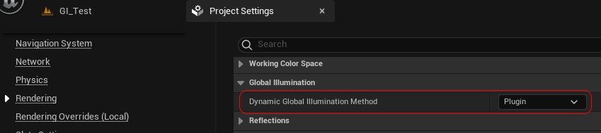
    -   另一种方式：在后处理设置中将 Dynamic Global Illumination Method 的覆盖值设为 Plugin。后处理设置会覆盖该控制台变量。
-   将 `r.RTXGI.DDGI` 控制台变量设为 `1` 以启用 RTXGI（可在 `.ini` 文件、控制台或蓝图中设置）。
-   在场景中放置 DDGIVolume actor，即可在体积内使用 RTX 全局光照。
-   就这样。用 RTXGI 去创造精彩的作品吧！在 [功能说明](#functionality) 中了解更多 RTXGI 功能，在 [美术师指南](#artist-overview) 中了解使用方法。
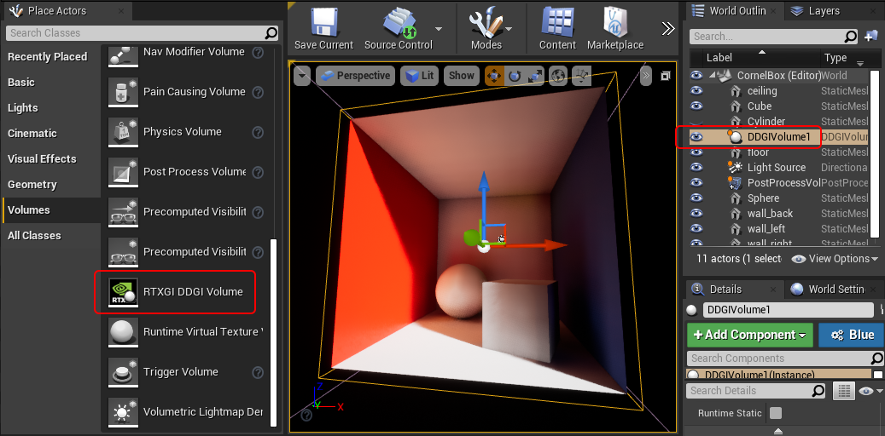

## <a name="functionality">功能说明</a>

RTXGI 实现了 *动态漫反射全局光照（Dynamic Diffuse Global Illumination，DDGI）* 算法来计算漫反射全局光照。DDGI 使用光线追踪，在一组规则排列的探针（Probe）网格上收集辐照度（Irradiance）和距离数据。这与你可能已经熟悉的现有辐照度探针方案类似，但现在辐照度和距离的计算是**实时**进行的。RTXGI 探针会随时间累积数据，并使用基于统计的方法来解析可见性并防止漏光。

**要在 UE 中使用 RTXGI，请在场景中放置 DDGIVolume actor**。这些体积内部包含一个探针网格，RTXGI 通过光线追踪对其更新。每帧按加权轮询（weighted round robin）方式更新一个 `DDGIVolume`，具体由体积的 **Update Priority（更新优先级）** 属性决定。

`DDGIVolume` 的许多属性都可以调整，下面会逐一讨论。

### RTXGI 体积属性

动态间接光照在体积内部由 RTXGI 生成。`DDGIVolume` 有很多可以调节的属性（如下方右侧所示），但默认值在大多数情况下都能取得不错的效果。

| GI Volume `DDGIVolume` 属性 |
|-----------------------------------|
| 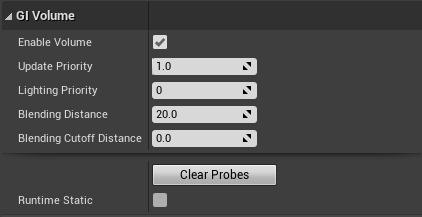 |

| 属性 | 说明 |
|--------------------------|-------------------------------------------------------------------------------------------------------------------------------------------------------------------------------------------------------------------------------------------------------------------------------------------------------------------------------------------------------------------------------------------------------------------------------------------------------------------------------------------------|
| Enable Volume | 手动启用或禁用该体积。 |
| Update Priority | 系统使用加权轮询方式更新体积。**更新优先级数值越高的体积，被更新的频率越高**。因此，随着场景中体积数量增加，系统更新所有体积所需的时间也会变长。 |
| Lighting Priority | 允许对体积进行自定义优先级排序的数值。如果同一时刻有多个体积位于视锥体内，系统会选择探针最密集的体积，用它来为附近的表面应用间接光照。**如果你想覆盖此行为，请将你想使用的体积设置为最低的 lighting priority 数值（并提高其他体积的 lighting priority 数值）**。 |
| Blending Distance | 指定 `DDGIVolume` 在体积边缘处的混合范围（以世界单位计）。这用于在体积边缘创建渐隐区域，也可作为一种艺术控制手段。例如，如果你希望体积顶部的穹顶天花板光照更少一些。 |
| Blending Cutoff Distance | 从体积边缘起、权重降为零（即变黑或让位于包裹它的体积）的距离，以世界单位计。如果不想让渐隐一直线性延伸到边缘，此属性会很有用。 |
| Clear Probes | 清空体积探针中存储的当前数据。 |
| Runtime Static | **标记为 runtime static 的体积会在编辑期（author-time）将间接光照存入探针，运行期间不再动态更新**。这可用于降低性能开销。例如，在关卡中放置一个探针稀疏的大体积并标记为 runtime static，用编辑器中计算好的间接光照填充场景；然后在运行时对重点区域使用更小、更密的 DDGIVolume 提供动态间接光照。 |

| GI Probes `DDGIVolume` 属性 |
|-------------------------------------|
|    |

| 属性 | 说明 |
|---------------------------------|----------------------------------------------------------------------------------------------------------------------------------------------------------------------------------------------------------------------------------------------------------------------------------------------------------------------------------------------------------------------------------------------------------------------------------------------------------------------------------------------------|
| Rays Per Probe | 设置每个探针追踪的射线数量。每探针射线数量越多，间接光照越稳定、图像质量越高，但性能开销也越高。**很多情况下，默认的每探针 288 条射线效果就很好**。 |
| Probe Counts | 设置 `DDGIVolume` 每个轴上放置的探针数量。体积内过高的探针数量通常没有必要。**我们建议探针间距为 2-3 米的探针网格**。稀疏的探针网格往往比密集网格产生更好的视觉效果，因为密集网格会把每个探针的影响局限在局部，有时甚至会暴露出探针网格的排布结构。**拿不定主意时，使用达到期望效果所需的最少探针数量即可**。 |
| Probe Max Ray Distance | 探针射线可以传播的最大距离。超过此距离就不会命中任何表面。在某些场景下减小该值可以提高性能。 |
| Probe History Weight | 取值在 \[0,1\] 范围内的数值，影响探针中光线追踪结果的时间累积。值为 1 时始终使用已有的探针数值，忽略最新追踪到的光线信息；值为 0 时始终使用最新追踪到的光线信息，忽略之前所有探针数据。此属性最好设置为能平衡先前与最新光线追踪数据的值。**默认值 0.97 在大多数情况下表现良好**。 |
| Automatic Probe Relocation | 每帧根据周围的世界几何体调整探针的位置。探针会被移动到能产生更好光照效果的位置，而不是（例如）位于墙体或其他物体内部。 |
| Probe Min Frontface Distance | 在 Probe Relocation 移动探针之前，允许探针到正面三角形的最小距离。 |
| Probe Backface Threshold | 探针所发射的射线中，允许命中背面三角形的比例。超过该比例后，Probe Relocation 和 State Classification 会判定探针位于几何体内部。 |
| Scroll Probes Infinitely | 将体积变成 **无限滚动体积（Infinite Scrolling Volume）**。体积会变为沿世界坐标轴对齐；当体积移动时，位于体积最外侧边缘的探针会被重新定位到体积相对一侧、沿移动方向的另一端（如同坦克履带一样“滚动”体积）。采用这种方式，大多数探针保持在各自的世界空间位置，从而在体积移动时获得更稳定的时序光照结果。 |
| Visualize Probes | 将当前体积的探针显示为球体网格。这可用于调试。你也可以在项目设置中更改可视化数据，或对所有体积统一覆盖探针的可视化方式。 |
| Probe Distance Exponent | 用于可见性测试的指数。较高的数值会对深度不连续快速作出反应，但可能导致条带（banding）伪影。 |
| Probe Irradiance Encoding Gamma | 一种用于对辐照度进行感知编码（perceptually encode）的指数，可加快从亮到暗的收敛速度。 |
| Probe Change Threshold | 在探针辐射混合（radiance blending）中使用的比例。用于识别何时发生较大光照变化。当上一次与当前辐照度之间最大颜色分量的差异大于此阈值时，会降低滞后（hysteresis）效果。 |
| Probe Brightness Threshold | 在探针辐射混合中使用的阈值，用于确定上一次与当前辐照度值之间允许的最大亮度差异。这可以防止一次更新周期中，脉冲（impulse）导致纹素辐照度发生剧烈变化。 |

| GI Lighting `DDGIVolume` 属性 |
|---------------------------------------|
|      |

| 属性 | 说明 |
|----------------------------|----------------------------------------------------------------------------------------------------------------------------------------------------------------------------------------------------------------------------------------------------------------------------------------------------------------------------------------------------------------------|
| Sky Light Type on Ray Miss | None/Raster/Ray Tracing - 指定当射线未命中场景几何体时，`DDGIVolume` 计算光照所使用天光（Sky Light）的类型。在 `DDGIVolume` 之外，你可以通过 `r.RayTracing.SkyLight` 控制天光的类型。 |
| View and Normal Bias | 与阴影贴图偏移类似，这些属性用于修正可见性伪影。如果你遇到漏光或阴影泄漏问题，请调整这些偏移值。**一般来说，view bias 的数值应为 normal bias 的 4 倍**。 |
| Light Multiplier | 用此设置人为增大或减小该体积贡献的 GI 光照量。请注意，该倍率同样会影响自发光（emissive）表面贡献的光照。 |
| Emissive Multiplier | 用此设置人为增大或减小自发光对该体积内 GI 的贡献量。 |
| 10-bit Irradiance Scalar | 一个 \[0,1\] 范围内的值，用于在使用 10 位辐照度纹理格式存储前缩放光照量级。读取时会将缩放后的数值还原，从而允许在 10 位纹理格式中存储更大的辐照度值。这样可以节省内存，代价是损失一些精度。 |

### 蓝图概览

RTXGI 向蓝图公开了多项功能。这样可以借助蓝图编辑器实现逻辑，在运行时控制不同的 DDGI 体积属性。所有函数都归在 “DDGI” 类别下，如下所示：

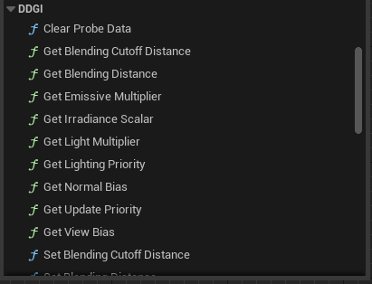

| 蓝图节点 | 说明 |
|-----------------------------|---------------------------------------------------|
| Clear Probe Data | 清空体积探针中存储的当前数据。 |
| Get ``Emissive Multiplier``、``Irradiance Scalar``、``Light Multiplier``、``Update Priority``、``Lighting Priority``、``Blending Distance``、``Blending Cutoff Distance``、``View Bias``、``Normal Bias`` | 获取对应属性的当前值。 |
| Set ``Emissive Multiplier``、``Irradiance Scalar``、``Light Multiplier``、``Update Priority``、``Lighting Priority``、``Blending Distance``、``Blending Cutoff Distance``、``View Bias``、``Normal Bias`` | 修改对应属性的值。 |
| Toggle Volume | 启用或禁用目标体积。 |
| Set Probes Visualization | 切换目标体积的探针可视化。 |

所有蓝图函数都可以通过 ``DDGIVolume Component`` 访问。当你对 ``DDGIVolume`` actor 调用蓝图函数时，蓝图编辑器会自动添加必要的 ``DDGIVolume Component``。

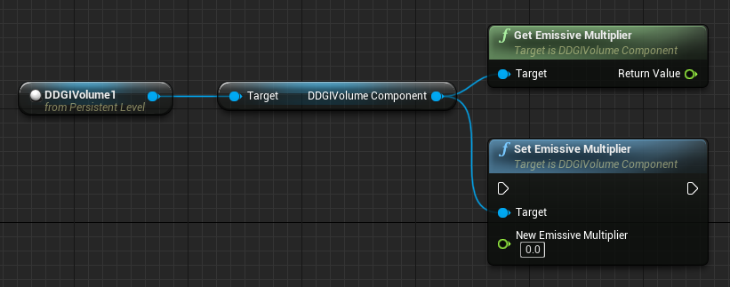

RTXGI 还提供了若干新的控制台变量（“cvars”）。下表对它们进行了说明。

### RTXGI 控制台变量

| 命令 | 选项 | 说明 |
|-----------------------------------|------------|--------------------------------------------------------------------------------------------------------------------------------------------------------------------------------------------------------------------|
| `r.RTXGI.DDGI` | 0, 1 | 开启或关闭 RTXGI。 |
| `r.RTXGI.DDGI.LightingPass.Scale` | 0.25 - 1.0 | 光照 Pass 的分辨率缩放，范围为 0.25 - 1.0（超出此范围的值会被钳制到该范围内）。 |
| `r.RTXGI.DDGI.ProbesTextureVis` | 0, 1, 2 | 切换探针可视化。这能让用户从摄像机的视角看到探针所“看到”的内容。在模式 2 下，射线未命中显示为蓝色，射线命中显示为绿色，射线背面命中显示为红色。 |
| `r.RTXGI.MemoryUsed` | 无 | 在输出日志中显示 RTXGI 所用显存的概要及详细信息。 |
| `Vis DDGIProbesTexture` | 无 | 允许用户查看 `r.RTXGI.DDGI.ProbesTextureVis` 命令生成的纹理。这有助于诊断因光照或几何体未配置为对光线追踪可见而导致的探针不准确问题。 |
| `r.RTXGI.DDGI.StatVolume` | 整数 | 指定显示哪个体积 STAT 的索引。每个体积的统计信息包括：样本数（Num Samples）、探针数量 XYZ（Probe Count X Y Z）和射线数（Num Rays）。 |

### 项目设置

RTXGI 插件在 UE 的项目设置对话框中有若干设置项。

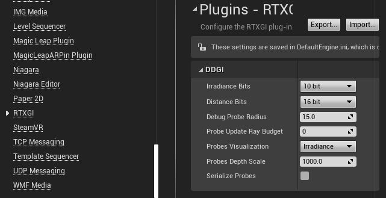

- **Irradiance Bits（辐照度位深）** - 默认使用每颜色通道 10 位的纹理格式来存储探针辐照度。对于超出常规范围的辐射度（extended radiance）或非常亮的光源，10 位可能不足以正确表示光的能量。可将辐照度纹理的位深提高到 32 位（使用 RGBA32F 纹理格式）以支持扩展辐射度，代价是内存占用增加。或者，使用 10 位辐照度并调整 *DDGIVolume* 的 **Irradiance Scalar** 选项，在存储前减小光照量级、读取后再放大回去。这样可以节省内存，但会损失一些精度。

- **Distance Bits（距离位深）** - 默认使用 16 位浮点格式在探针中存储距离（及距离平方），用于判断遮挡。当距离较大时，16 位可能不够用。可将距离纹理的位深提高到 32 位以获得更高精度。

- **Debug Probe Radius（调试探针半径）** - 设置可视化 ``DDGIVolume`` 探针时渲染球体的半径，以世界单位计。

- **Probe Update Ray Budget（探针更新射线预算）** - 设置更新探针时最多可投射的射线数量。0 表示不限制射线数量。一个 8x8x8 的体积、每探针 288 条射线，若要每帧完全更新所有探针，则需要指定 147,456。每帧会根据体积的优先级更新一个体积。体积优先级越高，被更新的频率越高。这些设置既可以为性能开销设置上限，也可以控制某个体积获得的射线更新比例（或光照滞后程度）。

- **Probes Visualization（探针可视化）** - 默认情况下，被可视化的探针会显示其辐照度；也可以切换为其他模式，包括命中距离（Hit Distance）和命中距离平方（Squared Hit Distance），或对所有体积禁用探针可视化。如果选择可视化距离，请结合下一个属性 “Probes Depth Scale” 来控制距离范围。

- **Probes Depth Scale（探针深度缩放）** - 当 “Probes Visualization” 模式设为距离时，可以调节此属性以获得更好的探针距离可视化效果。

- **Serialize Probes（探针序列化）** - 默认情况下探针数据会序列化到 .umap 文件中。可以通过此选项禁用序列化，以获得更小的磁盘地图文件。在禁用此选项的状态下重新保存地图，会清除之前存储的所有探针数据。

### 运行时统计信息

使用 `STAT RTXGI Performance` 查看 RTXGI 的运行时统计信息。所有统计值都是随时间取的平均值。

- **Total Number of Volumes** - 场景中体积的总数
- **Selected Volume Index** - 当前选中体积的索引，由 `r.RTXGI.DDGI.StatVolume` 设置
- **Num Samples (selected)** - 选中体积生成的样本总数。注意 Num Samples 是一个估算值，因为每条射线会生成 1 -（光源数量）个样本，精确计算样本数会带来严重的性能损失。
- **Probe Count X (selected)** - X 维度的探针数量
- **Probe Count Y (selected)** - Y 维度的探针数量
- **Probe Count Z (selected)** - Z 维度的探针数量
- **Rays Per Probe (selected)** - 每探针的射线数量
- **Samples Per Frame** - 所有体积的样本总数
- **RTXGI Samples Per Millisecond** - 每毫秒所有体积产生的样本数
- **RTXGI Samples Per Frame 60hz** - 在 60 fps 下所有体积可能产生的样本数，当当前帧率低于 60 时钳制为 0。
- **RTXGI GPU Time (ms)** - RTXGI 每帧占用的 GPU 时间（毫秒）
- **Total GPU Frametime (ms)** - 每帧总 GPU 时间（毫秒）
- **Frametime Without RTXGI (ms)** - 每帧 GPU 总时间减去 RTXGI 所耗时间（毫秒）

**限制**
   - RTXGI 无法在 UE 的前向渲染路径（forward rendering）下工作。
   - RTXGI 的光照在 UE 的其他光线追踪效果中不可见（例如光线追踪反射）。
   - 在 UE 4.27 中，将 `r.RayTracing.ForceAllRayTracingEffects` 控制台变量设为 `1` 时，RTXGI 会被 RTGI 覆盖。要显示 RTXGI 的效果，应将该控制台变量设回默认值 `-1`。

# <a name="artist-overview">美术师指南</a>

RTXGI 为 UE 的光线追踪全局光照提供了一种高性能选项。顾名思义，RTXGI 需要启用光线追踪并激活插件。

如果光线追踪不可用，RTXGI 插件会加载先前从支持光线追踪的平台（即 DirectX 12）存储到磁盘的探针纹理。

| **注意** |
| -------- |
| 当光线追踪不可用（例如在 DirectX 11 或 Vulkan RHI 下）时，``DDGIVolumes`` 仍可使用，但会以静态模式运行，即探针在运行时不会更新。|

| **注意** |
| -------- |
| 将 `DDGIVolume` 放置到世界中之后，探针会随时间累积反弹光照（bounce lighting）。|

## 在 UE 中放置 RTXGI 体积

你可以在 **Volumes**（如下所示）下找到 ``RTXGI DDGI Volume`` actor，并将其放置到关卡中。

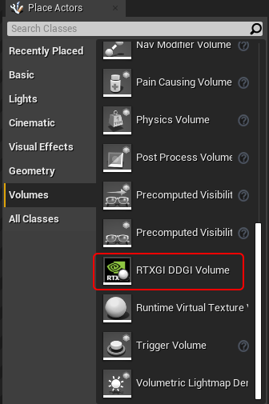

可以使用 UE 的所有原生变换工具（平移、旋转和缩放）来让体积贴合你的几何体。

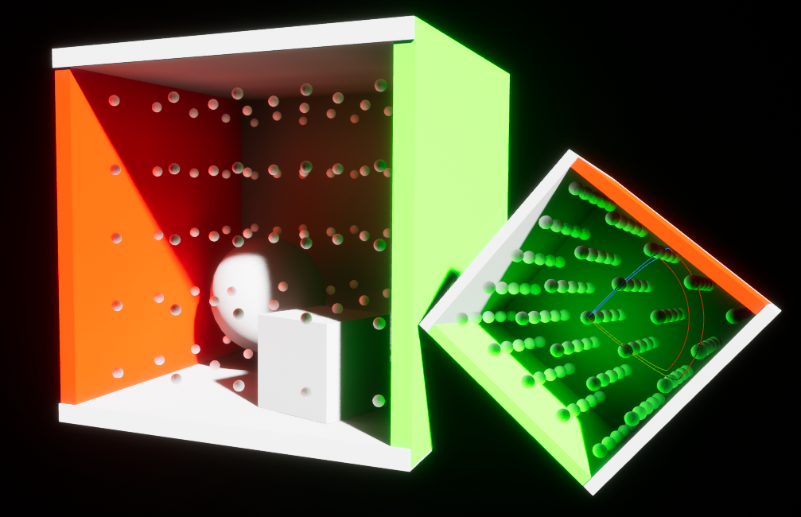

## 技巧与提示

### 禁用光照贴图（Lightmap）

如果将 RTXGI 作为项目的 GI 方案，建议禁用光照贴图支持，因为你是用 RTXGI 的动态无限反弹 GI 取代 Lightmass 的烘焙 GI。这有助于减少着色器排列组合（shader permutation），从而加快着色器编译。此外，由于不再需要额外的 UV 来烘焙光照贴图，还可以为静态网格体节省一些内存。

可以通过在项目设置中取消勾选 “Allow Static Lighting” 来禁用光照贴图支持。

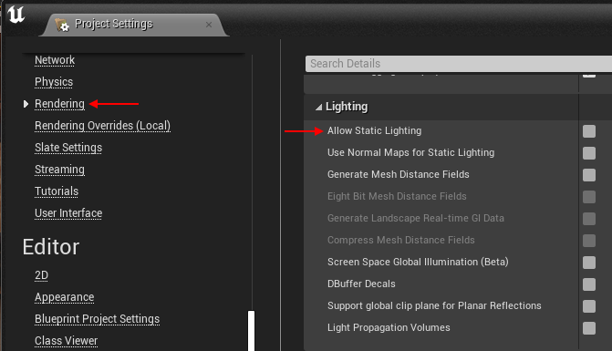

至于光照贴图 UV，可以在静态网格体导入选项中将其禁用。

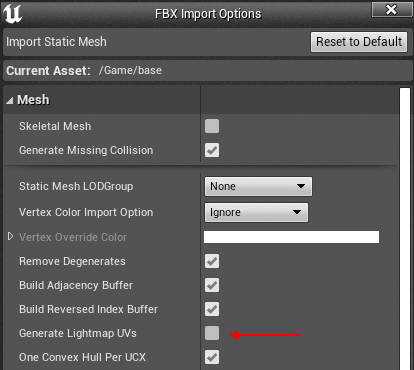

如果静态网格体已经生成了光照贴图 UV，可以在静态网格体编辑器中取消勾选 “Generate Lightmap UVs” 将其删除。

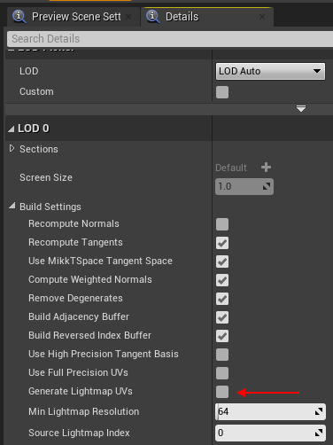

### 推荐使用稀疏探针布局

相对稀疏的探针网格既有利于高性能，也有利于高质量结果。作为起点，在典型的人体尺度室内场景中，我们建议探针间距约 2-3 米。在大型室外场景中，你可以用更稀疏的布局，依然能获得很好的效果！

| **注意** |
| -------- |
| 按照设计，RTXGI **不会**生成高频细节。增加探针密度在一定程度上有所帮助，但在任何密度下都无法产生精确或锐利的光照与阴影。对于高频细节，请使用其他形式的光照，例如 RTAO、RT 天光阴影和/或 RT 矩形光。|

你可以放置多个探针密度不同的 `DDGIVolumes`。系统始终会使用较密体积中的探针。如果需要在特定区域获得更高精度，可以这样做。有时并不需要一个昂贵的体积才能实现更精确的采样。右下角的体积是一个 5x5x5 的 `DDGIVolume`，使用默认的每探针 288 条射线。这样的体积相对廉价，却可以帮助你达到想要的效果！

| 推荐的探针密度 | 更高密度的“细节”体积 |
|---------------------------|----------------------------------|
|     | |

### 使用 RTXGI 时，自发光表面即光源

RTXGI 一个有趣的特点是能够将自发光物体视为光源。

| **注意** |
| -------- |
| 对于自发光物体，光线追踪不限于次级射线。RTXGI 同样会考虑首次射线命中。从美术师的角度看，这意味着自发光物体被视为直接光源，其阴影投射方式与 UE 的参数化光源类似。|

| 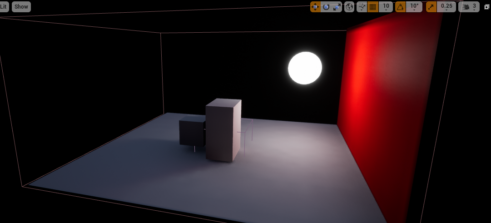 |
|:--:|
| *自发光球体产生直接光照并投射直接阴影* |

在这个 NVIDIA Attic 场景示例中，窗户外部放置了大型自发光网格体来产生额外光照。

|  |
|:--:|
| *在 NVIDIA Attic 外部添加的自发光网格体，用于补充光照* |

_使用 RTXGI 时，任何自发光表面都可以成为光源。_ 自发光网格体越大、对 RTXGI 探针物理上越可用，光照贡献就越大。也可以调高自发光表面的数值来产生更多光。采用这种方法时，你可能会发现把 10 位辐照度切换到 32 位更好，因为它能提供更细腻的光照贡献范围。不过，**32 位辐照度应谨慎使用**，因为它会使内存开销增加 3 倍。只在确有必要时才启用 32 位辐照度！

借助 RTXGI，现在可以用更少的点光源、聚光灯和/或区域光来照亮场景。取而代之的是，你可以依靠少量光源与自发光表面的组合。这一改变不仅能改善工作流和迭代时间，还可能提升性能（因为光源更少）。你可能会发现，承担 RTXGI 较小的固定成本，比使用大量投射阴影的光源更划算。**用这种方式照亮场景是一种不同的思路，但可能产生运行更快、也更容易创建的效果**。

**这里有一个实际例子：**

自发光网格体可以产生额外光线，同时不成为场景中可见的一部分。在 UE 中，自发光网格体可以被标记为_仅对光线追踪可见_。你可以创建“隐藏”的自发光网格体，在可见网格体太小而无法独立贡献光照的区域产生额外光照。为此，请使用 `RayTracingQualitySwitch` 节点。

| 来自隐藏自发光网格体的光照 | 可视化后的隐藏自发光网格体 |
|-----------------------------------------------|-----------------------------------|
| 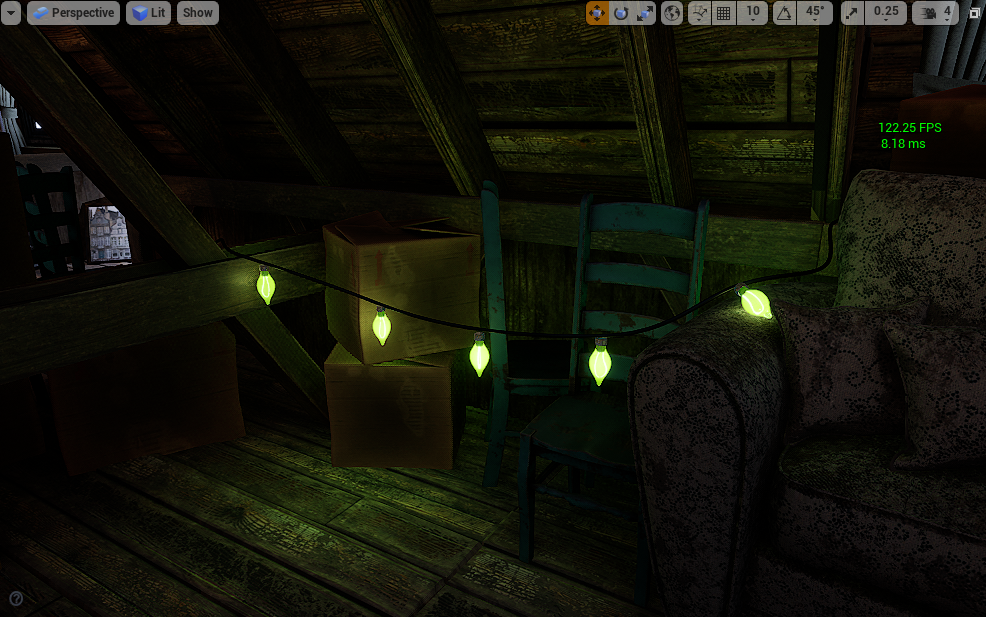            | 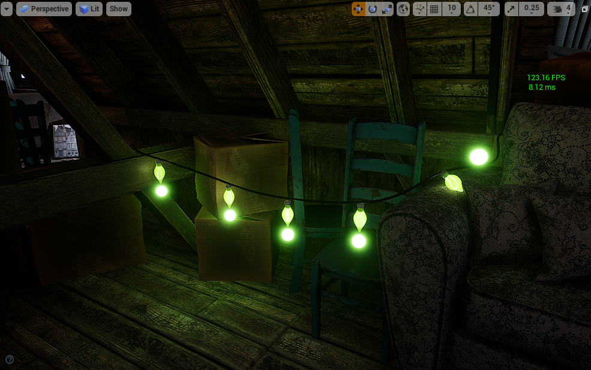      |

### 确保 RTXGI 在你需要的地方贡献光照

RTXGI 不会自动让每个表面都变得更亮。它可能需要一些精细调节，最终结果是材质、整体光照、后处理设置及其他选择的综合体现。开始建立全局光照贡献基线的一个便捷方法是，在 `Lightingonly` 模式下查看场景。`Lightingonly` 在这种情况下很有用，因为它会以平坦的 50% 灰色显示所有表面。开启和关闭 RTXGI 时，你能清晰地了解各种光源真正贡献的全局光照。

| **注意** |
| -------- |
| 即使表面显示为 50% 灰色，它们仍然会贡献颜色光照和反弹，因此你能很好地观察到光照的实际作用。|

| Lightingonly 模式，仅直接光照 | Lightingonly 模式，直接光照 + RTXGI |
|----------------------------------------------|---------------------------------------------------|
|                   | 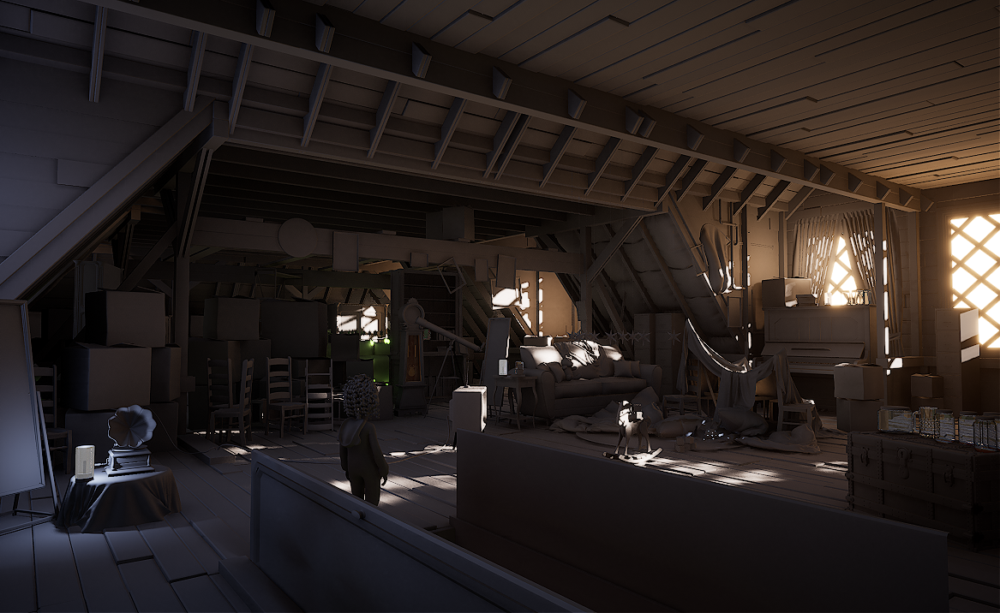                      |

可以想见，暗色表面反射光的能力较差（很暗的表面完全不反射光！）。如果你的纹理偏暗（通常低于 50% 亮度阈值），它们产生的反弹光会更少，全局光照贡献也更小。这不一定是坏结果。如果物体本来就该很暗，那么这样的光照正是所期望的，而且仍然基于物理。更亮的表面会贡献更明显的反弹光（因为它们会反射光）。想一想《镜之边缘》这类游戏的视觉效果——那些非常明亮、色彩鲜艳的表面，以及它们展现出的丰富间接反弹光照。

### 终极提示

思考你的表面以及它们与全局光照的关系。如果你的目标是确保场景中有大量间接光，即使是微小的数值变化也可能对最终的间接光照结果产生影响。有时只需要轻微的调整，就能得到你想要的结果。

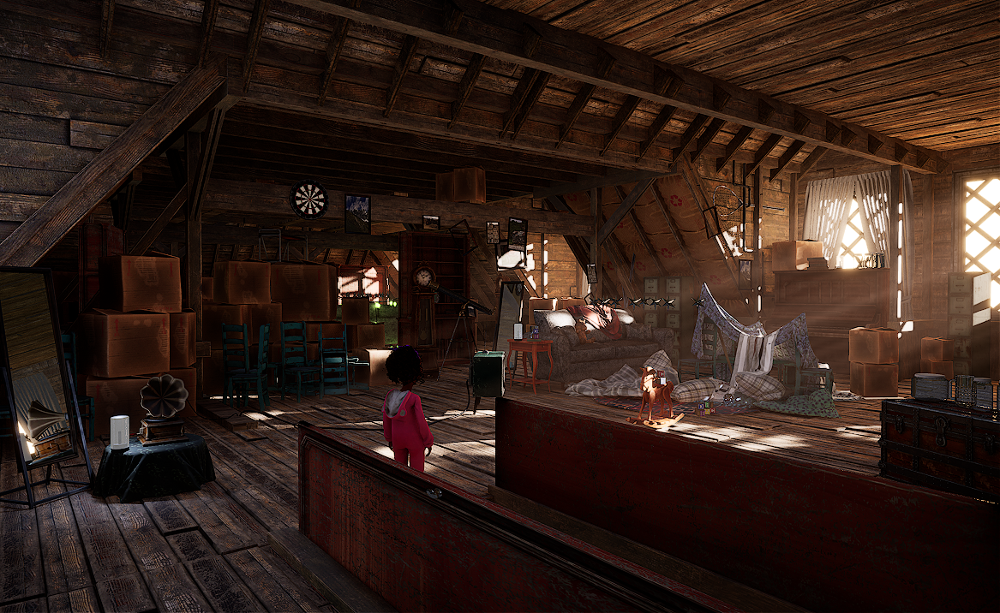

[direct]: ../images/ue4-plugin/direct-only.png
[indirect]: ../images/ue4-plugin/direct+rtxgi.png
